# Design Document: Fyers Auto Trading System

## Overview

The Fyers Auto Trading System is a desktop application built with PySide6 that provides a comprehensive trading interface for the Fyers broker. The system follows a layered architecture separating UI, business logic, and data access concerns. It integrates with existing Fyers API code for broker operations while adding user management, secure credential storage, and a modern GUI.

Key design principles:
- **Separation of Concerns**: Clear boundaries between UI, services, and data layers
- **Security First**: Encrypted credential storage, secure password hashing
- **Reusability**: Leverage existing Fyers API code without modification
- **Responsiveness**: Non-blocking UI with async operations and real-time updates

## Architecture

```mermaid
graph TB
    subgraph "Presentation Layer"
        LoginWindow[Login Window]
        RegisterWindow[Register Window]
        CredentialsWindow[Broker Credentials Window]
        DashboardWindow[Dashboard Window]
        subgraph "Dashboard Tabs"
            FundsTab[Funds Tab]
            PositionsTab[Positions Tab]
            HoldingsTab[Holdings Tab]
            OrderBookTab[Order Book Tab]
            WatchlistTab[Watchlist Tab]
        end
    end

    subgraph "Service Layer"
        AuthService[Auth Service]
        SessionService[Session Service]
        BrokerService[Broker Service]
        TradingService[Trading Service]
        WatchlistService[Watchlist Service]
        WebSocketService[WebSocket Service]
    end

    subgraph "Data Layer"
        UserRepository[User Repository]
        CredentialRepository[Credential Repository]
        WatchlistRepository[Watchlist Repository]
        EncryptionService[Encryption Service]
    end

    subgraph "External - Existing Fyers Code"
        FyersAuthAPI[fyers/api/auth_api.py]
        FyersDataAPI[fyers/api/data.py]
        FyersOrderAPI[fyers/api/order_api.py]
        FyersFundsAPI[fyers/api/funds.py]
        FyersWebSocket[fyers/streaming/]
        MasterContractDB[fyers/database/master_contract_db.py]
    end

    subgraph "Database"
        SQLiteDB[(SQLite Database)]
    end

    LoginWindow --> AuthService
    RegisterWindow --> AuthService
    CredentialsWindow --> BrokerService
    DashboardWindow --> TradingService
    DashboardWindow --> WatchlistService
    WatchlistTab --> WebSocketService

    AuthService --> UserRepository
    AuthService --> SessionService
    BrokerService --> CredentialRepository
    BrokerService --> EncryptionService
    BrokerService --> FyersAuthAPI
    TradingService --> FyersOrderAPI
    TradingService --> FyersFundsAPI
    TradingService --> FyersDataAPI
    WatchlistService --> WatchlistRepository
    WatchlistService --> MasterContractDB
    WebSocketService --> FyersWebSocket

    UserRepository --> SQLiteDB
    CredentialRepository --> SQLiteDB
    WatchlistRepository --> SQLiteDB
```



### Layer Responsibilities

**Presentation Layer**: PySide6 windows and widgets handling user interaction and display. Each window is a QMainWindow or QDialog with specific responsibilities.

**Service Layer**: Business logic and orchestration. Services are stateless and handle validation, coordination between repositories and external APIs.

**Data Layer**: Database access and data transformation. Repositories abstract SQLite operations, EncryptionService handles credential security.

**External Layer**: Existing Fyers API code used as-is. No modifications to existing files.

## Components and Interfaces

### 1. Authentication Components

```python
# services/auth_service.py
class AuthService:
    def __init__(self, user_repo: UserRepository, session_service: SessionService):
        pass
    
    def register(self, username: str, password: str, email: str) -> Result[User, str]:
        """Register new user with validation and password hashing"""
        pass
    
    def login(self, username: str, password: str) -> Result[Session, str]:
        """Authenticate user and create session"""
        pass
    
    def logout(self) -> None:
        """Clear current session"""
        pass

# services/session_service.py
class SessionService:
    def __init__(self):
        self._current_session: Optional[Session] = None
    
    def create_session(self, user: User) -> Session:
        """Create new session for authenticated user"""
        pass
    
    def get_current_session(self) -> Optional[Session]:
        """Get active session"""
        pass
    
    def clear_session(self) -> None:
        """Clear active session"""
        pass
    
    def is_authenticated(self) -> bool:
        """Check if user is authenticated"""
        pass
```

### 2. Broker Integration Components

```python
# services/broker_service.py
class BrokerService:
    def __init__(self, cred_repo: CredentialRepository, 
                 encryption_service: EncryptionService):
        pass
    
    def save_credentials(self, user_id: int, api_key: str, 
                        api_secret: str) -> Result[None, str]:
        """Encrypt and store broker credentials"""
        pass
    
    def get_credentials(self, user_id: int) -> Result[BrokerCredentials, str]:
        """Retrieve and decrypt broker credentials"""
        pass
    
    def has_credentials(self, user_id: int) -> bool:
        """Check if user has stored credentials"""
        pass
    
    def generate_oauth_url(self, api_key: str) -> str:
        """Generate Fyers OAuth authorization URL"""
        pass
    
    def authenticate_broker(self, request_token: str) -> Result[str, str]:
        """Exchange request token for access token using existing auth_api"""
        pass
    
    def store_access_token(self, user_id: int, access_token: str) -> None:
        """Store access token for session"""
        pass

# services/encryption_service.py
class EncryptionService:
    def __init__(self, key: bytes):
        """Initialize with encryption key derived from app secret"""
        pass
    
    def encrypt(self, plaintext: str) -> str:
        """Encrypt sensitive data using Fernet symmetric encryption"""
        pass
    
    def decrypt(self, ciphertext: str) -> str:
        """Decrypt encrypted data"""
        pass
```

### 3. Trading Components

```python
# services/trading_service.py
class TradingService:
    def __init__(self, access_token: str):
        self.access_token = access_token
    
    def get_funds(self) -> Result[FundsData, str]:
        """Fetch funds using existing funds.py get_margin_data"""
        pass
    
    def get_positions(self) -> Result[List[Position], str]:
        """Fetch positions using existing order_api.get_positions"""
        pass
    
    def get_holdings(self) -> Result[List[Holding], str]:
        """Fetch holdings using existing order_api.get_holdings"""
        pass
    
    def get_order_book(self) -> Result[List[Order], str]:
        """Fetch orders using existing order_api.get_order_book"""
        pass
    
    def place_order(self, order: OrderRequest) -> Result[str, str]:
        """Place order using existing order_api.place_order_api"""
        pass
    
    def modify_order(self, order_id: str, modifications: OrderModification) -> Result[None, str]:
        """Modify order using existing order_api.modify_order"""
        pass
    
    def cancel_order(self, order_id: str) -> Result[None, str]:
        """Cancel order using existing order_api.cancel_order"""
        pass
    
    def close_all_positions(self) -> Result[None, str]:
        """Close all positions using existing order_api.close_all_positions"""
        pass
```

### 4. Watchlist Components

```python
# services/watchlist_service.py
class WatchlistService:
    def __init__(self, watchlist_repo: WatchlistRepository):
        pass
    
    def add_symbol(self, user_id: int, symbol: str, exchange: str) -> Result[WatchlistItem, str]:
        """Add symbol to watchlist after validation"""
        pass
    
    def remove_symbol(self, user_id: int, symbol: str, exchange: str) -> Result[None, str]:
        """Remove symbol from watchlist"""
        pass
    
    def get_watchlist(self, user_id: int) -> List[WatchlistItem]:
        """Get user's watchlist"""
        pass
    
    def search_symbols(self, query: str, exchange: str) -> List[SymbolInfo]:
        """Search symbols using existing master_contract_db.search_symbols"""
        pass

# services/websocket_service.py
class WebSocketService:
    def __init__(self, access_token: str):
        self.access_token = access_token
        self._subscriptions: Dict[str, Callable] = {}
    
    def subscribe(self, symbol: str, exchange: str, 
                  callback: Callable[[QuoteData], None]) -> None:
        """Subscribe to real-time price updates"""
        pass
    
    def unsubscribe(self, symbol: str, exchange: str) -> None:
        """Unsubscribe from price updates"""
        pass
    
    def connect(self) -> None:
        """Establish WebSocket connection"""
        pass
    
    def disconnect(self) -> None:
        """Close WebSocket connection"""
        pass
```

### 5. Repository Components

```python
# repositories/user_repository.py
class UserRepository:
    def __init__(self, db_session):
        pass
    
    def create(self, username: str, password_hash: str, email: str) -> User:
        """Create new user record"""
        pass
    
    def find_by_username(self, username: str) -> Optional[User]:
        """Find user by username"""
        pass
    
    def find_by_id(self, user_id: int) -> Optional[User]:
        """Find user by ID"""
        pass
    
    def exists(self, username: str) -> bool:
        """Check if username exists"""
        pass

# repositories/credential_repository.py
class CredentialRepository:
    def __init__(self, db_session):
        pass
    
    def save(self, user_id: int, encrypted_api_key: str, 
             encrypted_api_secret: str) -> None:
        """Save encrypted credentials"""
        pass
    
    def get(self, user_id: int) -> Optional[EncryptedCredentials]:
        """Get encrypted credentials for user"""
        pass
    
    def exists(self, user_id: int) -> bool:
        """Check if credentials exist for user"""
        pass
    
    def update_access_token(self, user_id: int, access_token: str) -> None:
        """Update stored access token"""
        pass

# repositories/watchlist_repository.py
class WatchlistRepository:
    def __init__(self, db_session):
        pass
    
    def add(self, user_id: int, symbol: str, exchange: str) -> WatchlistItem:
        """Add item to watchlist"""
        pass
    
    def remove(self, user_id: int, symbol: str, exchange: str) -> None:
        """Remove item from watchlist"""
        pass
    
    def get_all(self, user_id: int) -> List[WatchlistItem]:
        """Get all watchlist items for user"""
        pass
    
    def exists(self, user_id: int, symbol: str, exchange: str) -> bool:
        """Check if item exists in watchlist"""
        pass
```

### 6. UI Components

```python
# ui/windows/login_window.py
class LoginWindow(QMainWindow):
    """Login screen with username/password fields"""
    login_successful = Signal(Session)
    register_requested = Signal()

# ui/windows/register_window.py
class RegisterWindow(QDialog):
    """Registration dialog with username/password/email fields"""
    registration_successful = Signal()

# ui/windows/credentials_window.py
class CredentialsWindow(QDialog):
    """Broker credentials entry and OAuth flow"""
    authentication_successful = Signal(str)  # access_token

# ui/windows/dashboard_window.py
class DashboardWindow(QMainWindow):
    """Main dashboard with tabbed interface"""
    logout_requested = Signal()

# ui/widgets/funds_widget.py
class FundsWidget(QWidget):
    """Display funds/margin information"""

# ui/widgets/positions_widget.py
class PositionsWidget(QWidget):
    """Display and manage positions"""
    close_position_requested = Signal(str)  # symbol
    close_all_requested = Signal()

# ui/widgets/holdings_widget.py
class HoldingsWidget(QWidget):
    """Display holdings"""

# ui/widgets/order_book_widget.py
class OrderBookWidget(QWidget):
    """Display orders with modify/cancel actions"""
    modify_order_requested = Signal(str)  # order_id
    cancel_order_requested = Signal(str)  # order_id

# ui/widgets/watchlist_widget.py
class WatchlistWidget(QWidget):
    """Watchlist with live prices"""
    add_symbol_requested = Signal(str, str)  # symbol, exchange
    remove_symbol_requested = Signal(str, str)
    place_order_requested = Signal(str, str)  # symbol, exchange

# ui/widgets/order_form_widget.py
class OrderFormWidget(QWidget):
    """Order entry form"""
    order_submitted = Signal(OrderRequest)

# ui/widgets/symbol_search_widget.py
class SymbolSearchWidget(QWidget):
    """Symbol search with autocomplete"""
    symbol_selected = Signal(str, str)  # symbol, exchange
```

## Data Models

```python
from dataclasses import dataclass
from typing import Optional, List
from enum import Enum
from datetime import datetime

# Enums
class OrderType(Enum):
    MARKET = 1
    LIMIT = 2
    SL = 3
    SL_MARKET = 4

class OrderAction(Enum):
    BUY = "BUY"
    SELL = "SELL"

class OrderStatus(Enum):
    OPEN = "open"
    COMPLETED = "completed"
    REJECTED = "rejected"
    CANCELLED = "cancelled"
    PENDING = "pending"

class ProductType(Enum):
    CNC = "CNC"      # Cash and Carry
    INTRADAY = "INTRADAY"
    MARGIN = "MARGIN"

# User Domain
@dataclass
class User:
    id: int
    username: str
    email: str
    password_hash: str
    created_at: datetime

@dataclass
class Session:
    user_id: int
    username: str
    created_at: datetime
    access_token: Optional[str] = None

# Credentials Domain
@dataclass
class BrokerCredentials:
    api_key: str
    api_secret: str

@dataclass
class EncryptedCredentials:
    user_id: int
    encrypted_api_key: str
    encrypted_api_secret: str
    access_token: Optional[str] = None

# Trading Domain
@dataclass
class FundsData:
    available_cash: float
    collateral: float
    utilized: float
    realized_pnl: float
    unrealized_pnl: float

@dataclass
class Position:
    symbol: str
    exchange: str
    quantity: int
    average_price: float
    ltp: float
    pnl: float
    product_type: str

@dataclass
class Holding:
    symbol: str
    exchange: str
    quantity: int
    average_price: float
    current_price: float
    pnl: float
    pnl_percentage: float

@dataclass
class Order:
    order_id: str
    symbol: str
    exchange: str
    action: OrderAction
    quantity: int
    order_type: OrderType
    price: Optional[float]
    trigger_price: Optional[float]
    status: OrderStatus
    filled_quantity: int
    average_price: float
    timestamp: datetime

@dataclass
class OrderRequest:
    symbol: str
    exchange: str
    action: OrderAction
    quantity: int
    order_type: OrderType
    product_type: ProductType
    price: Optional[float] = None
    trigger_price: Optional[float] = None

@dataclass
class OrderModification:
    order_id: str
    quantity: Optional[int] = None
    price: Optional[float] = None
    trigger_price: Optional[float] = None

# Watchlist Domain
@dataclass
class WatchlistItem:
    id: int
    user_id: int
    symbol: str
    exchange: str
    added_at: datetime

@dataclass
class QuoteData:
    symbol: str
    exchange: str
    ltp: float
    open: float
    high: float
    low: float
    close: float
    volume: int
    change: float
    change_percent: float
    bid: float
    ask: float
    timestamp: datetime

@dataclass
class SymbolInfo:
    symbol: str
    name: str
    exchange: str
    token: str
    lot_size: int
    tick_size: float

# Result Type for Error Handling
from typing import TypeVar, Generic, Union

T = TypeVar('T')
E = TypeVar('E')

@dataclass
class Ok(Generic[T]):
    value: T

@dataclass
class Err(Generic[E]):
    error: E

Result = Union[Ok[T], Err[E]]
```

### Database Schema

```sql
-- Users table
CREATE TABLE IF NOT EXISTS users (
    id INTEGER PRIMARY KEY AUTOINCREMENT,
    username TEXT UNIQUE NOT NULL,
    email TEXT NOT NULL,
    password_hash TEXT NOT NULL,
    created_at TIMESTAMP DEFAULT CURRENT_TIMESTAMP
);

-- Broker credentials table
CREATE TABLE IF NOT EXISTS broker_credentials (
    id INTEGER PRIMARY KEY AUTOINCREMENT,
    user_id INTEGER UNIQUE NOT NULL,
    encrypted_api_key TEXT NOT NULL,
    encrypted_api_secret TEXT NOT NULL,
    access_token TEXT,
    updated_at TIMESTAMP DEFAULT CURRENT_TIMESTAMP,
    FOREIGN KEY (user_id) REFERENCES users(id) ON DELETE CASCADE
);

-- Watchlist table
CREATE TABLE IF NOT EXISTS watchlist (
    id INTEGER PRIMARY KEY AUTOINCREMENT,
    user_id INTEGER NOT NULL,
    symbol TEXT NOT NULL,
    exchange TEXT NOT NULL,
    added_at TIMESTAMP DEFAULT CURRENT_TIMESTAMP,
    FOREIGN KEY (user_id) REFERENCES users(id) ON DELETE CASCADE,
    UNIQUE(user_id, symbol, exchange)
);

-- Create indexes
CREATE INDEX IF NOT EXISTS idx_users_username ON users(username);
CREATE INDEX IF NOT EXISTS idx_credentials_user_id ON broker_credentials(user_id);
CREATE INDEX IF NOT EXISTS idx_watchlist_user_id ON watchlist(user_id);
```


## Correctness Properties

*A property is a characteristic or behavior that should hold true across all valid executions of a system—essentially, a formal statement about what the system should do. Properties serve as the bridge between human-readable specifications and machine-verifiable correctness guarantees.*

### Property 1: Registration Input Validation
*For any* combination of username, password, and email strings, the registration validation SHALL accept only when all fields are non-empty AND the email matches a valid email format pattern.
**Validates: Requirements 1.1**

### Property 2: Password Hashing Security
*For any* password string, when stored in the database, the stored value SHALL be different from the original password AND the hash SHALL be verifiable against the original password using the same hashing algorithm.
**Validates: Requirements 1.2, 18.1**

### Property 3: Username Uniqueness
*For any* existing user in the database, attempting to register a new user with the same username SHALL result in rejection.
**Validates: Requirements 1.3**

### Property 4: Registration Persistence Round-Trip
*For any* valid registration data (username, password, email), after successful registration, querying the database by username SHALL return a user with matching username and email.
**Validates: Requirements 1.4**

### Property 5: Authentication Correctness
*For any* registered user, login with correct credentials SHALL succeed, and login with incorrect password SHALL fail.
**Validates: Requirements 2.1, 2.3**

### Property 6: Session Creation on Login
*For any* successful login, a session SHALL be created containing the user's ID and username.
**Validates: Requirements 2.2**

### Property 7: Session Persistence Across Navigation
*For any* authenticated session, navigating between application screens SHALL preserve the session state (user remains authenticated).
**Validates: Requirements 3.1**

### Property 8: Logout Clears Session
*For any* active session, after logout, the session SHALL be cleared (is_authenticated returns false).
**Validates: Requirements 3.2**

### Property 9: Broker Credentials Validation
*For any* API Key and API Secret input, validation SHALL pass only when both fields are non-empty strings.
**Validates: Requirements 4.1**

### Property 10: Credential Encryption Round-Trip
*For any* broker credentials (API Key, API Secret), encrypting then decrypting SHALL return the original values.
**Validates: Requirements 4.2, 4.3, 4.4, 18.2**

### Property 11: OAuth URL Generation
*For any* valid API Key, the generated OAuth URL SHALL contain the API Key as a parameter and point to the Fyers authorization endpoint.
**Validates: Requirements 5.1**

### Property 12: Funds Data Display Completeness
*For any* FundsData object, the display SHALL include available_cash, collateral, utilized, realized_pnl, and unrealized_pnl values.
**Validates: Requirements 6.2, 6.3**

### Property 13: Position Data Display Completeness
*For any* Position object, the display SHALL include symbol, quantity, average_price, ltp, and pnl values.
**Validates: Requirements 7.2**

### Property 14: Position Display Updates on Data Change
*For any* change in position data, the display SHALL reflect the updated values.
**Validates: Requirements 7.3**

### Property 15: Holdings Data Display Completeness
*For any* Holding object, the display SHALL include symbol, quantity, average_price, current_price, and pnl values.
**Validates: Requirements 8.2**

### Property 16: Order Data Display Completeness
*For any* Order object, the display SHALL include order_id, symbol, order_type, quantity, price, and status values.
**Validates: Requirements 9.2**

### Property 17: Pending Order Actions Availability
*For any* Order with status OPEN or PENDING, the UI SHALL provide modify and cancel action options.
**Validates: Requirements 9.3**

### Property 18: Order Status Visual Differentiation
*For any* set of orders with different statuses (OPEN, COMPLETED, REJECTED, CANCELLED), each status SHALL have a distinct visual representation.
**Validates: Requirements 9.4**

### Property 19: Market Order Price Field State
*For any* order form with Market order type selected, the price input field SHALL be disabled.
**Validates: Requirements 10.2**

### Property 20: Limit/SL Order Price Field State
*For any* order form with Limit or SL order type selected, the price input field SHALL be enabled and required.
**Validates: Requirements 10.3**

### Property 21: Order Request Validation
*For any* OrderRequest, validation SHALL pass only when symbol, exchange, action, quantity, order_type, and product_type are valid, AND price is provided for Limit/SL orders.
**Validates: Requirements 10.4**

### Property 22: Order Modification Form Population
*For any* pending Order selected for modification, the modification form SHALL be populated with the order's current values.
**Validates: Requirements 11.1**

### Property 23: Order Modification Validation
*For any* order modification, validation SHALL verify that modified fields contain valid values.
**Validates: Requirements 11.2**

### Property 24: Symbol Validation for Watchlist
*For any* symbol and exchange combination, adding to watchlist SHALL succeed only if the symbol exists in the master contract database.
**Validates: Requirements 13.1**

### Property 25: Watchlist Add/Remove Round-Trip
*For any* valid symbol added to watchlist, the symbol SHALL appear in the user's watchlist, and after removal, it SHALL no longer appear.
**Validates: Requirements 13.2, 13.4**

### Property 26: Watchlist Display Completeness
*For any* WatchlistItem with associated QuoteData, the display SHALL include symbol, ltp, change, and change_percent values.
**Validates: Requirements 13.3**

### Property 27: Watchlist Persistence Across Sessions
*For any* user's watchlist, after logout and login, the watchlist SHALL contain the same symbols.
**Validates: Requirements 13.5, 18.3**

### Property 28: WebSocket Subscription on Watchlist Display
*For any* watchlist being displayed, the system SHALL have active WebSocket subscriptions for all symbols in the watchlist.
**Validates: Requirements 14.1**

### Property 29: Real-Time Price Update Display
*For any* price update received via WebSocket, the corresponding symbol's display SHALL be updated with the new values.
**Validates: Requirements 14.2**

### Property 30: WebSocket Unsubscription on Navigation
*For any* navigation away from watchlist, the system SHALL unsubscribe from WebSocket for watchlist symbols.
**Validates: Requirements 14.3**

### Property 31: Stale Price Indicator
*For any* symbol in watchlist while WebSocket is disconnected, the display SHALL show a stale data indicator.
**Validates: Requirements 14.5**

### Property 32: Symbol Search Results
*For any* search query, the results SHALL contain only symbols that match the query pattern, and each result SHALL include symbol, name, and exchange.
**Validates: Requirements 15.1, 15.2**

### Property 33: UI Responsiveness
*For any* window size within supported range, the UI layout SHALL adapt without content being cut off or overlapping.
**Validates: Requirements 16.4**

### Property 34: Loading Indicator Display
*For any* API operation in progress, a loading indicator SHALL be visible to the user.
**Validates: Requirements 16.5**

### Property 35: Validation Error Field Highlighting
*For any* validation error, the invalid field SHALL be visually highlighted.
**Validates: Requirements 17.2**

### Property 36: Error Logging
*For any* error that occurs in the system, an entry SHALL be written to the log with error details.
**Validates: Requirements 17.3**

## Error Handling

### Error Categories

1. **Validation Errors**: Invalid user input (empty fields, malformed data)
   - Display inline error messages near the invalid field
   - Highlight the field with error styling
   - Do not submit until corrected

2. **Authentication Errors**: Invalid credentials, expired tokens
   - Display error message in dialog
   - For expired tokens, redirect to re-authentication flow
   - Clear sensitive data from memory

3. **Network Errors**: API failures, timeout, connection issues
   - Display user-friendly error message
   - Provide retry option
   - Log detailed error for debugging

4. **Database Errors**: SQLite connection failures, constraint violations
   - Display generic error message to user
   - Log detailed error
   - Attempt recovery or graceful degradation

5. **WebSocket Errors**: Connection drops, subscription failures
   - Attempt automatic reconnection with exponential backoff
   - Show connection status indicator
   - Display stale data indicator when disconnected

### Error Response Format

```python
@dataclass
class ErrorResponse:
    code: str           # Error code for programmatic handling
    message: str        # User-friendly message (Hindi-English)
    details: Optional[str]  # Technical details for logging
    field: Optional[str]    # Field name for validation errors
```

### Recovery Strategies

| Error Type | Strategy |
|------------|----------|
| Network timeout | Retry with exponential backoff (max 3 attempts) |
| Token expired | Redirect to OAuth flow |
| WebSocket disconnect | Auto-reconnect with backoff |
| Database locked | Retry after short delay |
| Validation failure | Show error, allow correction |

## Testing Strategy

### Unit Testing

Unit tests focus on specific examples, edge cases, and component isolation:

- **Services**: Test business logic with mocked dependencies
- **Repositories**: Test database operations with in-memory SQLite
- **Encryption**: Test encrypt/decrypt with known values
- **Validation**: Test boundary conditions and edge cases

### Property-Based Testing

Property-based tests verify universal properties across generated inputs using **Hypothesis** library:

**Configuration**:
- Minimum 100 iterations per property test
- Use `@given` decorator with appropriate strategies
- Tag format: `# Feature: fyers-auto-trading-system, Property N: [property_text]`

**Key Properties to Test**:

1. **Password Hashing** (Property 2)
   - Generate random passwords
   - Verify hash differs from original
   - Verify hash verification works

2. **Credential Encryption Round-Trip** (Property 10)
   - Generate random credential strings
   - Encrypt then decrypt
   - Verify original equals decrypted

3. **Registration Persistence** (Property 4)
   - Generate valid user data
   - Register and retrieve
   - Verify data matches

4. **Authentication Correctness** (Property 5)
   - Generate users with passwords
   - Test correct and incorrect passwords
   - Verify expected outcomes

5. **Order Validation** (Property 21)
   - Generate various OrderRequest combinations
   - Verify validation logic correctness

6. **Watchlist Persistence** (Property 27)
   - Generate watchlist operations
   - Verify persistence across sessions

### Integration Testing

- Test Fyers API integration with sandbox/mock server
- Test WebSocket connection and data flow
- Test end-to-end user flows

### UI Testing

- Test widget rendering and layout
- Test user interactions (clicks, input)
- Test navigation between screens
- Use Qt Test framework for PySide6 widgets

### Test Organization

```
tests/
├── unit/
│   ├── services/
│   │   ├── test_auth_service.py
│   │   ├── test_broker_service.py
│   │   ├── test_trading_service.py
│   │   └── test_watchlist_service.py
│   ├── repositories/
│   │   ├── test_user_repository.py
│   │   ├── test_credential_repository.py
│   │   └── test_watchlist_repository.py
│   └── test_encryption_service.py
├── property/
│   ├── test_password_hashing_props.py
│   ├── test_encryption_props.py
│   ├── test_registration_props.py
│   ├── test_authentication_props.py
│   ├── test_order_validation_props.py
│   └── test_watchlist_props.py
├── integration/
│   ├── test_fyers_api_integration.py
│   └── test_websocket_integration.py
└── ui/
    ├── test_login_window.py
    ├── test_dashboard_window.py
    └── test_order_form.py
```
